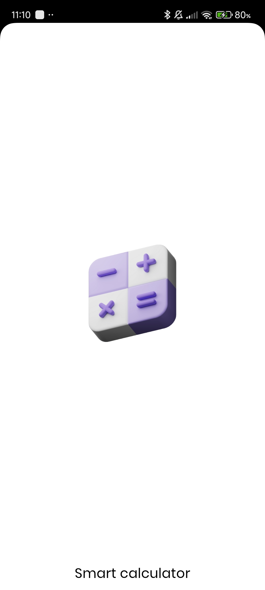
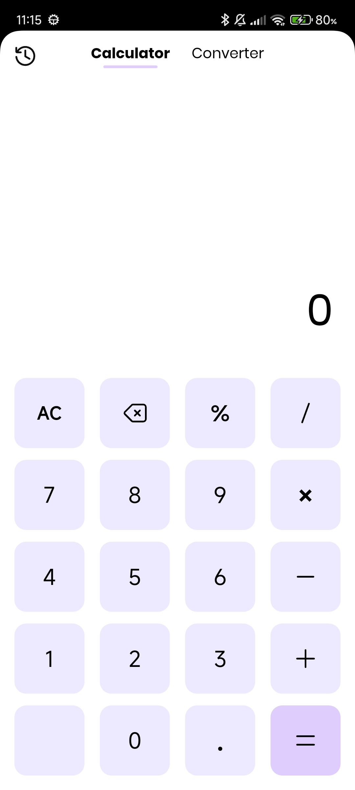
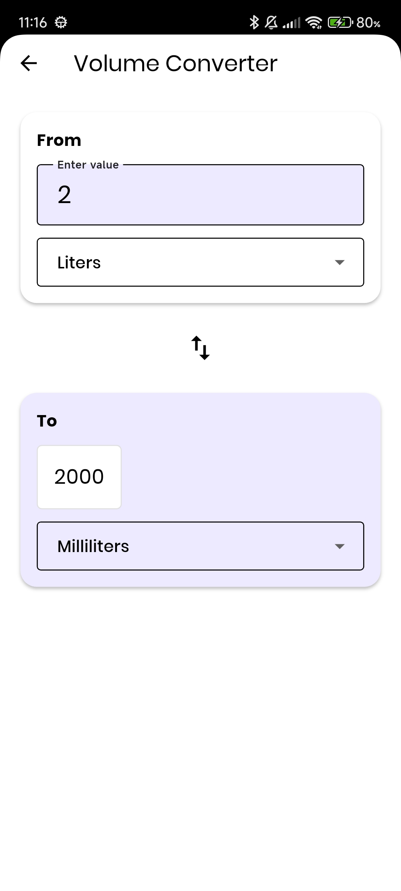
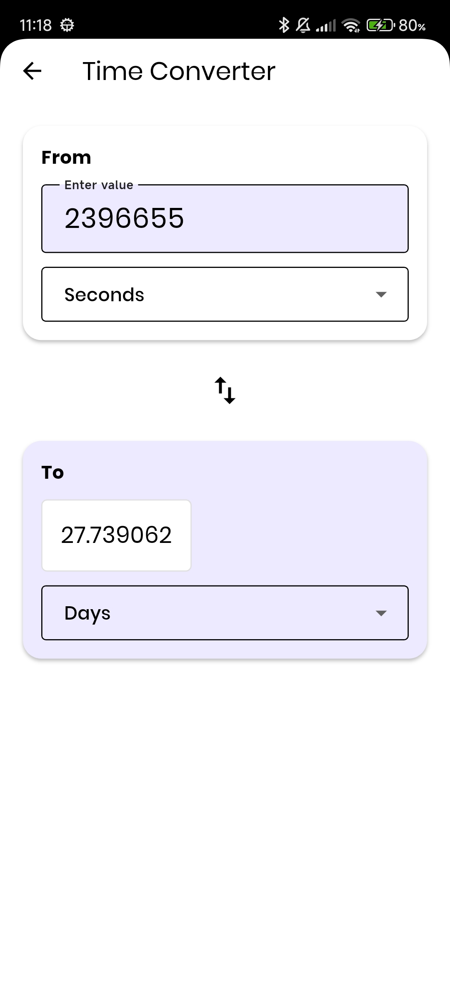
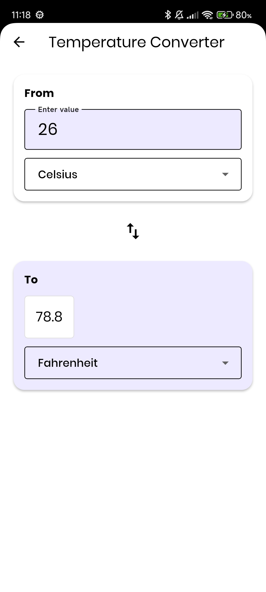
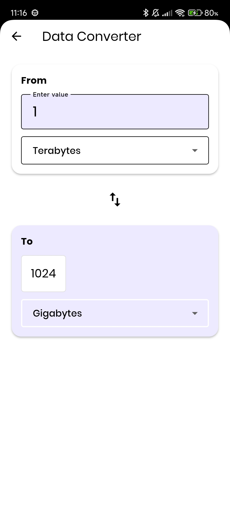

# 🧮 Smart Calculator


A comprehensive Flutter application that combines a powerful calculator with multiple unit converters, providing users with essential mathematical and conversion tools in one convenient app, built with Clean Architecture principles and featuring a stunning UI.

## 📱 Screenshots

<!-- Add your screenshots here -->

<div align="center">
   
  
  
  
  
  
  
  

  
  
  
</div>

## ✨ Features

- 🧮 **Advanced Calculator**: Perform basic and advanced mathematical operations
- 🔄 **Multiple Converters**: Convert between various units (Volume, Data, Age, Discount, Time, Temperature)
- ✅ **Input Validation**: Smart validation for accurate calculations and conversions
- 🎨 **Beautiful UI**: Clean, modern interface with intuitive design
- 📱 **Responsive Design**: Adaptive UI that works seamlessly across different screen sizes
- ⚡ **Fast & Efficient**: Optimized performance with proper state management
- 🏗️ **Clean Architecture**: Well-structured codebase following Clean Architecture principles

## 🎨 Design

- **Color Scheme**: Modern theme with elegant styling
- **Typography**: Poppins font family for a modern, clean look
- **Material Design**: Latest Material Design guidelines
- **Smooth Interactions**: Engaging user experience with responsive feedback

## 🏗️ Architecture

This project follows **Clean Architecture** principles with clear separation of concerns:

```
lib/
├── core/
│   └── theme.dart                    # App-wide theme configurations
├── data/
│   ├── models/
│   │   └── calculation_model.dart    # Data model for calculations
│   └── repositories/
│       ├── calculator_repository_impl.dart  # Calculator repository implementation
│       └── converter_repository_impl.dart   # Converter repository implementation
├── domain/
│   ├── entities/
│   │   ├── calculation.dart          # Calculation entity
│   │   └── converter.dart            # Converter entity
│   ├── repository/
│   │   ├── calculator_repository.dart # Calculator repository interface
│   │   └── converter_repository.dart  # Converter repository interface
│   └── usecases/
│       ├── calculate.dart            # Calculate use case
│       └── convert_unit.dart         # Convert unit use case
└── presentation/
    ├── controller/
    │   ├── calculator_controller.dart # Calculator state management
    │   └── converter_controller.dart  # Converter state management
    ├── Screen/
    │   ├── age_calculator_screen.dart      # Age calculator screen
    │   ├── calculator_screen.dart          # Main calculator screen
    │   ├── converter_screen.dart           # Converter selection screen
    │   ├── data_converter_screen.dart      # Data converter screen
    │   ├── discount_calculator_screen.dart # Discount calculator screen
    │   ├── homepage_screen.dart            # Home page screen
    │   ├── onboarding_screen.dart          # Onboarding screen
    │   ├── splash_screen.dart              # Splash screen
    │   ├── standard_converter_screen.dart  # Standard converter screen
    │   ├── temperature_converter_screen.dart # Temperature converter screen
    │   ├── time_converter_screen.dart      # Time converter screen
    │   └── volume_converter_screen.dart    # Volume converter screen
    └── widgets/
        ├── calculator_button_widget.dart   # Calculator button widget
        ├── Clickable_converter_widget.dart # Clickable converter widget
        ├── input_card_widget.dart          # Input card widget
        └── output_card_widet.dart          # Output card widget
```

### Architecture Layers

1. **Domain Layer**: Contains business logic, entities, and repository interfaces
2. **Data Layer**: Implements repositories and handles data operations
3. **Presentation Layer**: UI components, state management, and user interactions

## 🛠️ Technologies & Packages

- **Flutter SDK**: ^3.9.2
- **GetX**: ^4.7.2 - State management
- **Sqflite**: ^2.4.2 - Local database
- **Flutter SVG**: ^2.2.2 - SVG icon support
- **Clean Architecture**: Design pattern for maintainable code

## 🚀 Getting Started

### Prerequisites

- Flutter SDK (^3.9.2)
- Dart SDK
- Android Studio / VS Code
- Android device or emulator / iOS device or simulator

### Installation

1. **Clone the repository**

   ```bash
   git clone https://github.com/yourusername/smart_calculator.git
   cd smart_calculator
   ```

2. **Install dependencies**

   ```bash
   flutter pub get
   ```

3. **Run the app**
   ```bash
   flutter run
   ```

## 📖 How to Use

### Calculator
1. **Launch the app** and navigate to the Calculator tab
2. **Enter numbers** using the keypad
3. **Use operators** (+, -, ×, ÷) to build expressions
4. **Tap "="** to calculate the result
5. **Use AC** to clear all input or backspace to delete last character

### Converters
1. **Navigate to Converter tab**
2. **Select a converter** (Volume, Data, Age, Discount, Time, Temperature)
3. **Enter input value** and select units
4. **View instant conversion** results


## 🎯 Key Features Explained

### Calculator Operations

The calculator supports a wide range of mathematical operations:
- **Basic Arithmetic**: Addition, subtraction, multiplication, division
- **Advanced Operations**: Percentage calculations, decimal handling
- **Real-time Display**: Live expression preview as you type
- **Error Handling**: Smart validation to prevent invalid operations
- **History**: Track previous calculations (if implemented)

### Unit Conversions

Comprehensive unit conversion system with multiple categories:
- **Volume**: Conversions between liters, gallons, milliliters, cubic meters, etc.
- **Data**: Digital storage units (Bytes, KB, MB, GB, TB, PB)
- **Age**: Age calculations in years, months, days, hours
- **Discount**: Calculate discounts, final prices, and savings percentages
- **Time**: Time conversions (hours, minutes, seconds, days, weeks)
- **Temperature**: Temperature scales (Celsius, Fahrenheit, Kelvin)
- **Standard Units**: Additional standard unit conversions

### State Management

Implements GetX for efficient state management:
- **Reactive Programming**: Real-time UI updates
- **Controller Pattern**: Separate business logic from UI
- **Dependency Injection**: Clean separation of concerns
- **Performance Optimized**: Minimal rebuilds and efficient data flow

### Theme System

Comprehensive theming with:
- **Custom Color Scheme**: Modern, accessible color palette
- **Poppins Font Family**: Clean, readable typography
- **Material Design 3**: Latest design guidelines
- **Dark/Light Mode**: Adaptive theming (if implemented)
- **Consistent Styling**: Unified look across all components

### Input Validation

Smart validation features:
- **Real-time Feedback**: Immediate error detection
- **Format Checking**: Ensures correct input formats
- **Boundary Validation**: Prevents invalid ranges
- **User Guidance**: Helpful error messages and hints

### Responsive Design

Adaptive UI that works on:
- **Mobile Devices**: Optimized for phones and tablets
- **Different Screen Sizes**: Flexible layouts
- **Orientation Changes**: Portrait and landscape support
- **Accessibility**: Screen reader support and high contrast


## 🤝 Contributing

We welcome contributions to the Smart Calculator project! Here's how you can help:

### How to Contribute

1. **Fork the repository** on GitHub
2. **Clone your fork** locally:
   ```bash
   git clone https://github.com/yourusername/smart_calculator.git
   cd smart_calculator
   ```
3. **Create a feature branch**:
   ```bash
   git checkout -b feature/your-feature-name
   ```
4. **Make your changes** and ensure they follow the project structure
5. **Test your changes** thoroughly
6. **Commit your changes**:
   ```bash
   git commit -m "Add: Brief description of your changes"
   ```
7. **Push to your fork**:
   ```bash
   git push origin feature/your-feature-name
   ```
8. **Create a Pull Request** on GitHub

### Guidelines

- Follow the existing code style and architecture
- Write clear, concise commit messages
- Add tests for new features
- Update documentation as needed
- Ensure all tests pass before submitting

### Development Setup

- Use Flutter SDK ^3.9.2
- Run `flutter pub get` to install dependencies
- Use `flutter analyze` to check code quality
- Run tests with `flutter test`

### Reporting Issues

- Use GitHub Issues to report bugs or request features
- Provide detailed steps to reproduce bugs
- Include device/emulator information and Flutter version

## 📞 Support

If you have any questions or need help, please open an issue in the GitHub repository.

---

<p align="center">Made with ❤️ using Flutter</p>
